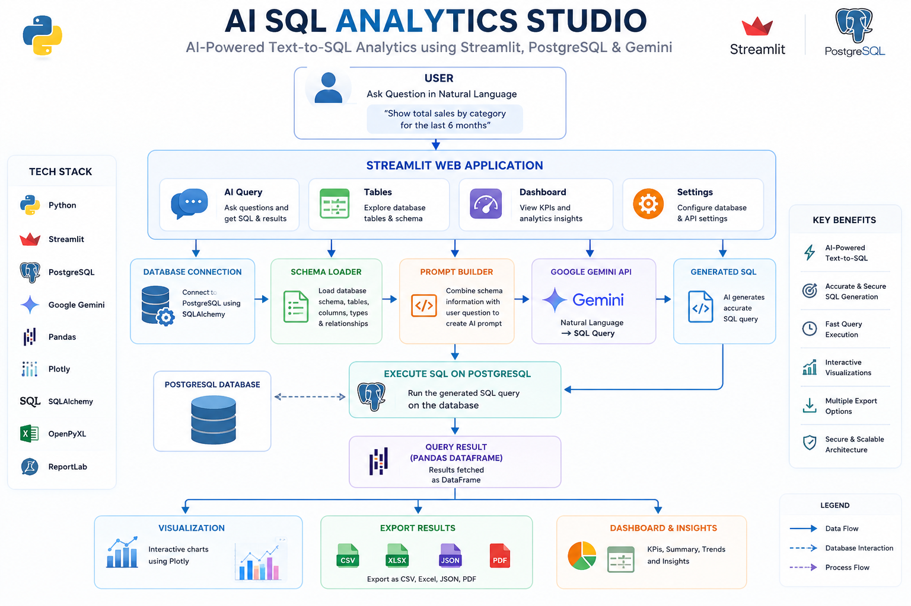

# 🤖 AI SQL Analytics Studio

An AI-powered Text-to-SQL Analytics application built with **Python**, **Streamlit**, **PostgreSQL**, and **Google Gemini**.  
The application allows users to ask questions in natural language, automatically generates SQL queries using AI, executes them on a PostgreSQL database, and visualizes the results through interactive charts.

---

## 🚀 Features

- 🤖 AI-powered Text-to-SQL using Google Gemini
- 🗄️ PostgreSQL Database Integration
- 📊 Interactive Dashboard
- 📋 Database Table Explorer
- 📈 Interactive Data Visualizations
- 📥 Export Query Results
  - CSV
  - Excel
  - JSON
  - PDF
- 🔍 Automatic Database Schema Detection
- ⚡ Session-based Query Management
- 🎨 Modern Streamlit User Interface

---
---

## 🏗️ Project Workflow

<p align="center">
  
</p>

This workflow illustrates how the application converts natural language into SQL using Google Gemini, executes the query on PostgreSQL, visualizes the results, and supports exporting reports in multiple formats.

---

## 📸 Screenshots

> Add screenshots inside a folder named **screenshots**.

### AI Query


### Database Tables


### Dashboard


### Visualization


---

## 🛠️ Technologies Used

### Frontend
- Streamlit

### Backend
- Python

### Database
- PostgreSQL

### AI Model
- Google Gemini API

### Data Processing
- Pandas
- SQLAlchemy

### Visualization
- Plotly

### Export
- OpenPyXL
- ReportLab

---

## 📂 Project Structure

```text
AI_SQL_Analytics_Studio/
│
├── app.py
├── config.py
├── database.py
├── gemini_service.py
├── prompt_builder.py
├── schema_loader.py
├── visualization.py
├── export_utils.py
├── report_generator.py
├── requirements.txt
├── README.md
└── screenshots/
```

---

## ⚙️ Installation

### Clone Repository

```bash
git clone https://github.com/Rakesh-584/AI-based-text-to-sql.git
```

### Go to Project Folder

```bash
cd AI-based-text-to-sql
```

### Install Requirements

```bash
pip install -r requirements.txt
```

### Run the Application

```bash
streamlit run app.py
```

---

## 🗄️ Database Configuration

Update your PostgreSQL configuration in `config.py`.

Example:

```python
DB_HOST = "localhost"
DB_PORT = "5432"
DB_USER = "postgres"
DB_NAME = "Ecommerce"
```

When the application starts, enter:

- PostgreSQL Password
- Gemini API Key

---

## 💡 Example Questions

- Show all customers.
- Display top 10 selling products.
- Calculate total revenue by category.
- Show customers with the highest spending.
- List products that have never been ordered.
- Find monthly sales for 2025.

---

## 📊 Export Options

The application supports exporting query results as:

- CSV
- Excel
- JSON
- PDF

---

## 🔮 Future Enhancements

- Query History
- Favorite Queries
- User Authentication
- Multi-Database Support
- Database Connection Manager
- AI Query Suggestions
- Dark Mode
- Interactive HTML Report Export
- Cloud Deployment

---

## 👨‍💻 Author

**Rakesh Gunti**

- GitHub: https://github.com/Rakesh-584

---

## ⭐ If you found this project useful

Please consider giving it a ⭐ on GitHub.

---

## 📜 License

This project is licensed under the MIT License.
